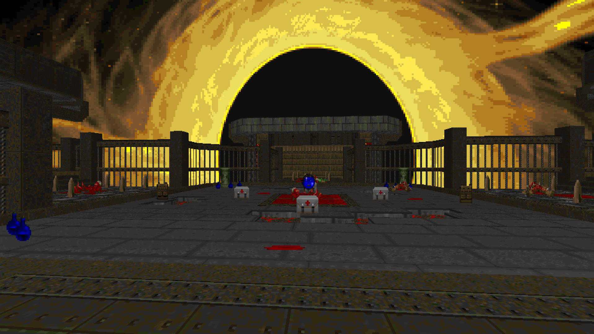
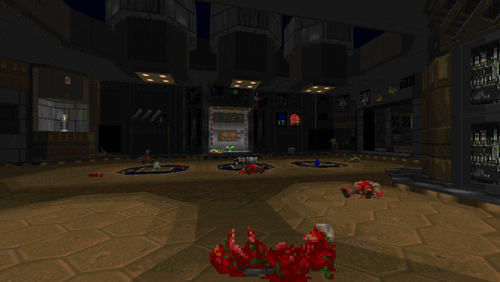
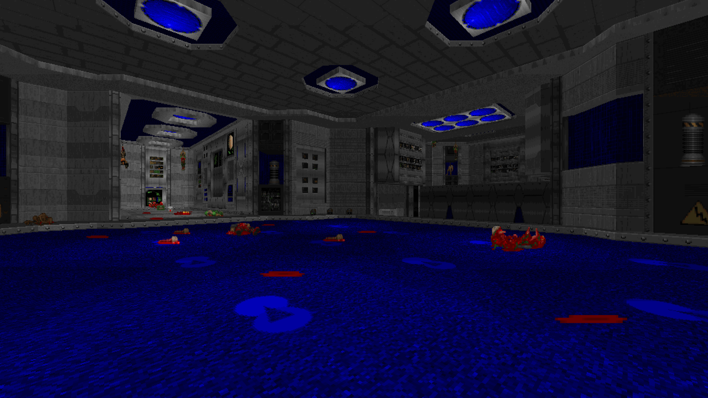
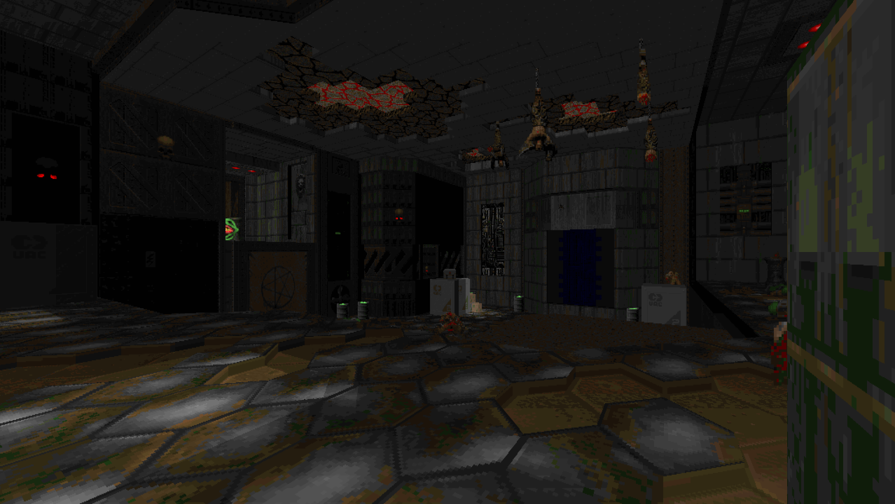
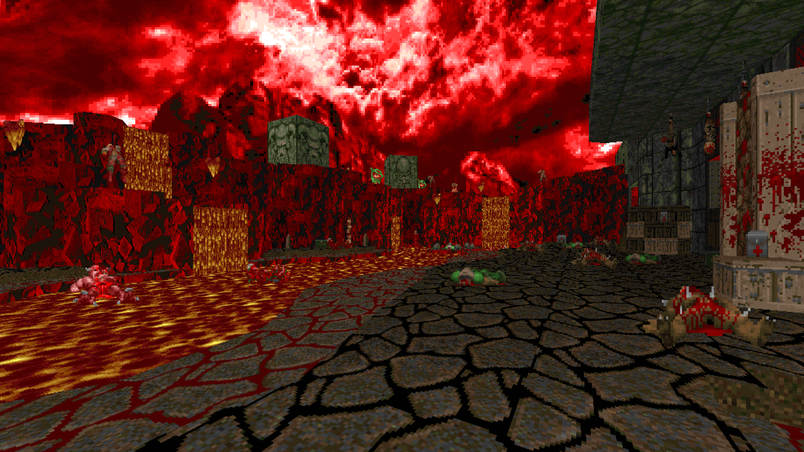

**IWAD:** Doom 2

**Level:** One level

**Map Format:** Boom (Doom Format) + UMAPINFO

**Tested with:** DSDA 0.27.5, GZDoom 4.12.1, Doom Retro 5.4.0, Doom + Doom II v1.3

**Download**: Here

Lore: 

With the support of T.N.T (The New Technologies), U.A.C has developed a new prototype that changes the gravity of a certain object (to enhance or invert it)

Initially, there were no side effects: scientists and human subjects tested it on themselves and felt fine, exactly until one man felt strange after the experiment. He felt like he had been turned inside out and saw strange anomalies and distortions. 

Naturally, the development was not shut down. The first prototype soon stopped working and it was sent to the centre of Complex B near the main processor, which ensures the operation of all gravitrons

The most successful prototypes were installed throughout Complex B and there are only 4 of them. Plus one that didn't work.

When the demonic invasion came, the gravitrons surrendered to the forces of hell, and now the illusions came true. Those who used the gravitron went to hell and need to activate the machine again to return to the normal world...

After a month of invasion, two soldiers reached the complex and split into two paths. The protagonist of this fable, went to Complex B and is tasked with blowing up the processor to deactivate the gravitrons throughout Complex B.

When the protagonist gets to the first prototype and finds himself facing a terrifying object in the universe: a Black Hole - the result of excessively strong gravity. You find yourself on an abandoned ship, but the processor associated with the gravitron here... 

### Version 2.0
### Main Changes  
- The map is now fully playable in both **Doom** and **Doom II**.  
  (For some reason, `BossAction` doesn’t work in UMAPINFO and is replaced with `BossActionEdNum`.)  
- Fixed sky transfers  
- Fixed minor bugs  

### Additions  
- Added a few more enemies (the balance already feels solid, so nothing major was changed). 

### Screenshots

